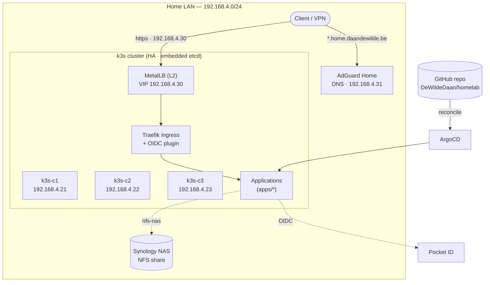
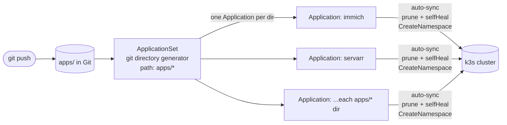
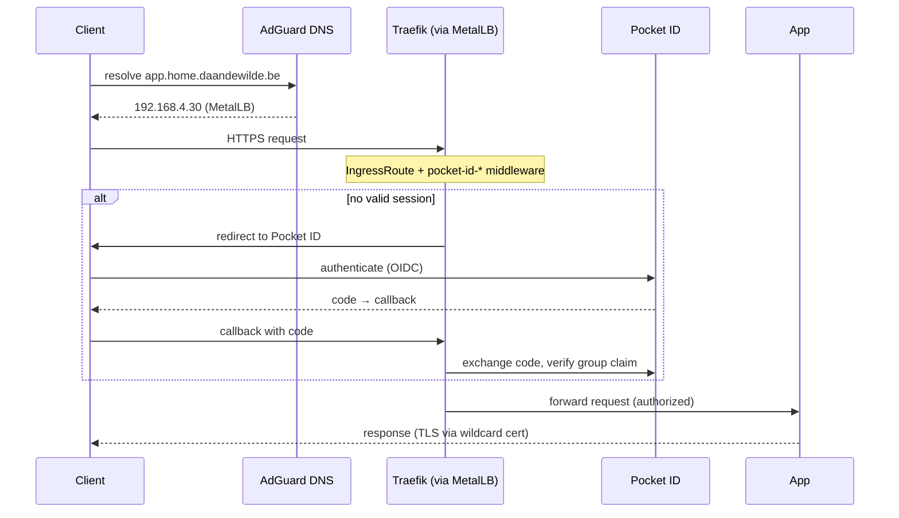
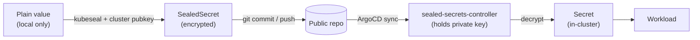

# Homelab

A GitOps-driven Kubernetes homelab running on three Proxmox mini PCs. The whole
cluster state — infrastructure add-ons and applications alike — is declared in
this repository and reconciled by ArgoCD. Secrets are encrypted before they hit
Git, so the repo is safe to keep public.

**Author:** Daan De Wilde
**Status:** Live
**Last Updated:** 2026-07-04

> **Two companion docs live alongside this one:**
> - [`setup.md`](./setup.md) — the bare-metal runbook for bootstrapping the k3s cluster from scratch (including the two nasty cross-node networking bugs that ate a day the first time).
> - [`prompt.md`](./prompt.md) — the system prompt that encodes this homelab's deployment standards, used to generate new application manifests consistently.

---

## Table of Contents

1. [Overview](#overview)
2. [Goals & Principles](#goals--principles)
3. [Physical & Virtual Infrastructure](#physical--virtual-infrastructure)
4. [Kubernetes — k3s](#kubernetes--k3s)
5. [GitOps — ArgoCD](#gitops--argocd)
6. [Networking](#networking)
7. [TLS & DNS](#tls--dns)
8. [Authentication — Pocket ID SSO](#authentication--pocket-id-sso)
9. [Secrets Management](#secrets-management)
10. [Storage](#storage)
11. [Security & Maintenance](#security--maintenance)
12. [Applications](#applications)
13. [Repository Structure](#repository-structure)
14. [Deploying a New Application](#deploying-a-new-application)
15. [Architectural Decisions (ADRs)](#architectural-decisions-adrs)

---

## Overview

Three mini PCs run Proxmox VE. Each hosts a single Ubuntu Server VM, and each VM
is a k3s server node. Together the three nodes form one highly-available k3s
cluster (embedded etcd, all nodes are control-plane + workload).

Everything on top of raw k3s — CNI extras, load balancing, ingress config,
certificates, storage, auth, and every application — is defined as a Helm chart
under [`apps/`](./apps) and deployed by ArgoCD. Adding a workload means adding a
directory and pushing; ArgoCD generates an Application for it automatically.

The design favours **simplicity and low maintenance for a solo operator** over
maximal sophistication. Where the original design doc reached for heavier tools
(OpenTofu, Calico, ingress-nginx, kube-vip), the built system deliberately keeps
the batteries k3s already ships and layers the rest through GitOps.



Each mini PC runs Proxmox → one Ubuntu VM → one k3s server node. ArgoCD keeps the
cluster in sync with this repo; Traefik (behind MetalLB) is the single ingress
entry point, with Pocket ID providing SSO and the NAS providing bulk storage.

---

## Goals & Principles

| Goal              | Description                                                                                    |
| ----------------- | ---------------------------------------------------------------------------------------------- |
| GitOps-first      | Cluster state is driven from Git. ArgoCD is the single source of truth for everything on-cluster. |
| Public-repo safe  | No plaintext secrets are ever committed. Everything sensitive is a SealedSecret.               |
| Simple to operate | Solo operator. Prefer k3s defaults and maintained upstream Helm charts over bespoke tooling.   |
| Single sign-on    | One identity provider (Pocket ID) fronts every app, natively via OIDC or via a Traefik middleware. |
| Internal-only     | All services are reachable on the LAN / over VPN. Nothing is exposed to the public internet.    |
| Reproducible      | The bare-metal bootstrap is a documented runbook ([`setup.md`](./setup.md)); the rest is declarative. |

---

## Physical & Virtual Infrastructure

Three identical mini PCs, each running Proxmox VE with a single Ubuntu Server
26.04 LTS VM. Each VM is a k3s server node.

| Node     | IP             | Role                                        |
| -------- | -------------- | ------------------------------------------- |
| `k3s-c1` | `192.168.4.21` | Control-plane + etcd + workloads (bootstrap) |
| `k3s-c2` | `192.168.4.22` | Control-plane + etcd + workloads            |
| `k3s-c3` | `192.168.4.23` | Control-plane + etcd + workloads            |

Supporting infrastructure on the same `192.168.4.0/24` network:

| Host        | IP             | Purpose                                    |
| ----------- | -------------- | ------------------------------------------ |
| MetalLB VIP | `192.168.4.30` | LoadBalancer IP fronting Traefik ingress   |
| AdGuard DNS | `192.168.4.31` | Split-horizon DNS + ad blocking            |
| Synology NAS| —              | NFS share for bulk persistent storage      |

> **Proxmox is a manual foundation layer.** Proxmox install, the VMs, and the k3s
> cluster are bootstrapped by hand following [`setup.md`](./setup.md). This is an
> explicit exception to "everything in code" — for a three-node homelab, a
> documented runbook is simpler to maintain than an IaC pipeline for the base
> layer. Proxmox VM snapshots provide backup at this level.

---

## Kubernetes — k3s

[k3s](https://k3s.io) is the Kubernetes distribution — a CNCF-conformant,
single-binary build from Rancher that makes install and upgrade trivial.

### Topology

- **3 server nodes with embedded etcd.** etcd quorum needs an odd number; 3 is
  the minimum for HA. Losing any one node keeps the cluster running.
- **No dedicated workers** — every node runs workloads. Acceptable for a homelab;
  mitigate control-plane starvation with resource requests/limits.
- The kubeconfig currently points at `k3s-c1` (`192.168.4.21`). The cluster
  survives losing any node, but the API endpoint in the kubeconfig is a single
  address — a future `kube-vip` VIP would remove that operational wrinkle.

### What's kept vs. disabled

Unlike the original design (which planned to strip k3s bare and re-add Calico +
ingress-nginx), the built cluster **keeps most of what k3s ships**:

| k3s component            | Status   | Notes                                                          |
| ------------------------ | -------- | ------------------------------------------------------------- |
| Flannel (VXLAN) CNI      | **Kept** | Simple, no router config. See the checksum-offload note below. |
| Traefik ingress          | **Kept** | Configured via a `HelmChartConfig` override, not replaced.     |
| Network-policy controller| Disabled | `disable-network-policy: true` — avoids the kube-router conflict. |
| ServiceLB (klipper)      | —        | LoadBalancer IPs are handed out by MetalLB instead.           |

> **Two bootstrap gotchas (documented in [`setup.md`](./setup.md)):**
> 1. **`disable-network-policy: true` must be set *before* k3s first starts** —
>    otherwise k3s' built-in network-policy controller and kube-router fight over
>    iptables marks and silently drop cross-node TCP.
> 2. **Flannel VXLAN TX checksum offload must be turned off on every node**
>    (`ethtool -K flannel.1 tx-checksum-ip-generic off`, made persistent via a
>    systemd unit) — otherwise cross-node UDP/TCP is silently dropped while ICMP
>    still works, producing baffling DNS/HTTP timeouts.

Nodes are ordinary Ubuntu boxes with SSH; `kubectl` is available on each as
`k3s kubectl`. Upgrades follow the standard k3s procedure.

---

## GitOps — ArgoCD

ArgoCD is the reconciliation engine. Everything after the raw cluster is managed
through it.

### ApplicationSet, not App-of-Apps

A single **`ApplicationSet`** with a Git *directory* generator watches
[`apps/*`](./apps) in this repo. Every subdirectory automatically becomes its own
ArgoCD Application:

```yaml
generators:
  - git:
      repoURL: https://github.com/DeWildeDaan/homelab
      revision: HEAD
      directories:
        - path: apps/*
template:
  metadata:
    name: '{{path.basename}}'
  spec:
    source:
      repoURL: https://github.com/DeWildeDaan/homelab
      path: '{{path}}'
    destination:
      namespace: '{{path.basename}}'   # namespace == app name
    syncPolicy:
      automated:
        prune: true      # removed from Git → removed from cluster
        selfHeal: true   # drift is corrected automatically
      syncOptions:
        - CreateNamespace=true
```

The result: **drop a chart directory into `apps/`, push, and it deploys.** No
per-app Application manifest to hand-write. Namespaces are created automatically
and named after the directory.



Ordering between resources (e.g. CRDs before the workloads that use them) is
handled with ArgoCD **sync waves** (`argocd.argoproj.io/sync-wave` annotations).

### Chart strategy

Every app is a small **umbrella Helm chart**: a `Chart.yaml` that declares the
upstream chart as a dependency, plus a `values.yaml` overriding only what's
needed and a `templates/` folder for homelab-specific extras (IngressRoute,
SealedSecret, PVC…). Where no suitable upstream chart exists, the
[bjw-s `app-template`](https://github.com/bjw-s-labs/helm-charts) chart is used as
a generic building block — see [`apps/servarr`](./apps/servarr), which aliases it
nine times for the media stack.

---

## Networking

### Load balancing — MetalLB

[MetalLB](https://metallb.io) in **Layer 2 mode** assigns real LAN IPs to
`LoadBalancer` services from the pool `192.168.4.30–192.168.4.50`. Traefik's
service is pinned to `192.168.4.30`, which is the single ingress entry point for
the whole cluster.

> L2 mode elects one node to own each VIP via ARP, so failover is fast but not
> instant. Fine for a homelab; BGP mode (Ubiquiti supports it) would be the path
> to true active/active later.

### Ingress — Traefik

Traefik is the k3s-bundled ingress controller, reconfigured through a
`HelmChartConfig` in [`apps/traefik-config`](./apps/traefik-config):

- `web` (:80) redirects to `websecure` (:443)
- A cluster-wide **default TLS certificate** (the wildcard, see below) is set in
  Traefik's `tlsStore`, so individual apps don't need to reference a cert
- Cross-namespace references are enabled so middlewares in `kube-system` can be
  used by IngressRoutes anywhere
- The `traefik-oidc-auth` plugin is loaded for SSO (see
  [Authentication](#authentication--pocket-id-sso))

**Every application is exposed through a Traefik `IngressRoute`** (not a stock
`Ingress`) at `https://<app>.home.daandewilde.be`.

### Access model

All services are **internal-only** — reachable on the LAN or over VPN. Nothing is
published to the public internet, so no per-app public hardening beyond normal
Kubernetes best practice is required.

---

## TLS & DNS

### cert-manager + Cloudflare DNS-01

[cert-manager](https://cert-manager.io) issues certificates from Let's Encrypt
using the **DNS-01 challenge** against Cloudflare — which works for internal-only
services because no inbound HTTP is required.

- A `ClusterIssuer` named `letsencrypt-prod` solves DNS-01 via the Cloudflare API
- A single **wildcard `Certificate`** for `*.home.daandewilde.be` (ECDSA P-256,
  90-day, auto-renew at 15 days) is issued into `kube-system` and wired in as
  Traefik's default cert — so every app gets TLS for free
- The Cloudflare API token is stored as a **SealedSecret**

See [`apps/cert-manager`](./apps/cert-manager).

### Split-horizon DNS — AdGuard Home

AdGuard Home (`192.168.4.31`) resolves `*.home.daandewilde.be` to the internal
MetalLB IP (`192.168.4.30`), so internal names never leave the LAN. It doubles as
a network ad blocker. AdGuard itself runs in-cluster
([`apps/adguard`](./apps/adguard)). Cloudflare holds the public zone; internal
records are not published there.

---

## Authentication — Pocket ID SSO

[Pocket ID](https://pocket-id.org) is the self-hosted OIDC identity provider,
running in-cluster ([`apps/pocketid`](./apps/pocketid)) at
`https://auth.home.daandewilde.be`. Every application is put behind it using one
of two strategies:

1. **App supports OIDC** → configure it to use Pocket ID directly (client secret
   stored as a SealedSecret).
2. **App has no OIDC** → protect it at the edge with a **Traefik middleware** that
   runs the [`traefik-oidc-auth`](https://github.com/sevensolutions/traefik-oidc-auth)
   plugin.

Two middlewares are defined in `kube-system`
([`apps/traefik-config`](./apps/traefik-config)) and referenced by IngressRoutes
across namespaces (group claims come from Pocket ID):

| Middleware         | Allowed groups        | Use for                        |
| ------------------ | --------------------- | ------------------------------ |
| `pocket-id-admins` | `admin`               | Admin/infra UIs (Longhorn, *arr, Trivy…) |
| `pocket-id-users`  | `admin`, `non_admin`  | General user-facing apps       |

The plugin's config secret and the OIDC client secret are both SealedSecrets.

The request path for a middleware-protected app, end to end:



---

## Secrets Management

[Bitnami Sealed Secrets](https://github.com/bitnami-labs/sealed-secrets) keeps the
repo public-safe. Secrets are encrypted **client-side** with the cluster's public
key and committed as `SealedSecret` custom resources; the in-cluster controller
(namespace `sealed-secrets`, controller `sealed-secrets-controller`) decrypts them
into normal `Secret` objects.

```bash
# Encrypt a single value for a specific secret + namespace
echo -n 'REPLACE_ME' | kubeseal \
  --controller-name sealed-secrets-controller \
  --controller-namespace sealed-secrets \
  --raw \
  --namespace <namespace> \
  --name <secret-name>
# Paste the ciphertext into the SealedSecret manifest — safe to commit.
```



**Never commit a plain `Secret`.** All API keys, tokens, passwords, OIDC client
secrets, and the Cloudflare token live in the repo only as SealedSecrets.

> **Back up the controller key pair.** Everything is encrypted to it — losing it
> means resealing every secret. Export and store it encrypted, offline.

---

## Storage

Two StorageClasses, chosen per workload:

| StorageClass | Backend                                   | Use for                                                        |
| ------------ | ----------------------------------------- | ------------------------------------------------------------- |
| `nfs-nas`    | Synology NAS via `nfs-subdir-external-provisioner` ([`apps/nfs-storage`](./apps/nfs-storage)) | **Preferred / default.** Media, downloads, photos, documents, backups, bulk data. |
| `longhorn`   | [Longhorn](https://longhorn.io) distributed block storage ([`apps/longhorn`](./apps/longhorn)) | Latency-sensitive data: config databases, app metadata (Sonarr/Radarr config, etc.). |

The rule of thumb (encoded in [`prompt.md`](./prompt.md)): **default to `nfs-nas`;
reach for `longhorn` only when NFS latency actually hurts** (small, frequently-hit
config DBs). This is a change from the original NFS-only design — Longhorn was
added because some app metadata was noticeably slow on NFS.

Longhorn provides in-cluster replication and its own backup mechanism; the NAS
provides bulk capacity. Node OS disks hold only the OS and ephemeral pod data.

---

## Security & Maintenance

- **Vulnerability scanning** — [Trivy Operator](https://aquasecurity.github.io/trivy-operator)
  continuously scans workloads for vulnerabilities and misconfigurations, with a
  web dashboard behind `pocket-id-admins` ([`apps/trivy`](./apps/trivy)).
- **Dependency updates** — [Renovate](https://docs.renovatebot.com)
  ([`renovate.json`](./renovate.json)) opens PRs for Helm chart and image updates,
  grouped one-PR-per-app, using semantic commits and a dependency dashboard.
  Floating/preview tags (some *arr images) are pinned by digest; vulnerability
  alerts are surfaced immediately.
- **Backups** — Longhorn volume backups and Proxmox VM snapshots already exist;
  no additional backup tooling is layered on.

---

## Applications

Everything under [`apps/`](./apps) is deployed automatically by ArgoCD.

### Platform / infrastructure

| App                                        | Purpose                                                    |
| ------------------------------------------ | ---------------------------------------------------------- |
| [`argocd`](./apps/argocd)                  | IngressRoute exposing the ArgoCD UI                        |
| [`metallb`](./apps/metallb)                | L2 LoadBalancer, IP pool `192.168.4.30–.50`               |
| [`traefik-config`](./apps/traefik-config)  | Traefik overrides, OIDC plugin, Pocket ID middlewares      |
| [`cert-manager`](./apps/cert-manager)      | Let's Encrypt DNS-01 issuer + wildcard cert                |
| [`sealed-secrets`](./apps/sealed-secrets)  | Sealed Secrets controller                                  |
| [`nfs-storage`](./apps/nfs-storage)        | NFS provisioner → `nfs-nas` StorageClass                   |
| [`longhorn`](./apps/longhorn)              | Distributed block storage → `longhorn` StorageClass        |
| [`adguard`](./apps/adguard)                | Split-horizon DNS + ad blocking                            |
| [`pocketid`](./apps/pocketid)              | Pocket ID OIDC identity provider                           |
| [`trivy`](./apps/trivy)                    | Trivy Operator vulnerability scanning + dashboard          |

### Workloads

| App                                        | Purpose                                                    |
| ------------------------------------------ | ---------------------------------------------------------- |
| [`servarr`](./apps/servarr)                | Media stack: Jellyfin, Sonarr, Radarr, Prowlarr, Bazarr, qBittorrent, Jellyseerr, FlareSolverr, Maintainerr |
| [`immich`](./apps/immich)                  | Self-hosted photo & video backup                           |
| [`paperless-ngx`](./apps/paperless-ngx)    | Document management & OCR                                   |
| [`bentopdf`](./apps/bentopdf)              | PDF toolkit                                                 |
| [`vaultwarden`](./apps/vaultwarden)        | Password manager (Bitwarden-compatible)                    |

---

## Repository Structure

```
homelab/                         # Public GitHub repository
├── README.md                    # This document
├── setup.md                     # Bare-metal k3s bootstrap runbook
├── prompt.md                    # Deployment-standards system prompt for new apps
├── renovate.json                # Renovate dependency-update config
├── image.png                    # Architecture diagram
│
└── apps/                        # Everything ArgoCD manages (one dir per app)
    └── <app>/
        ├── Chart.yaml           # Umbrella chart → upstream chart dependency
        ├── values.yaml          # Overrides for the upstream chart
        ├── charts/              # Vendored chart dependencies
        └── templates/           # IngressRoute, SealedSecret, PVC, Middleware, …
```

Each `apps/<app>` directory is picked up by the ArgoCD ApplicationSet and
deployed into a namespace named after the directory.

> **Note:** `.gitignore` still carries OpenTofu/Terraform entries from the
> original IaC design. There is no `tofu/` directory today — the base layer is
> provisioned manually per [`setup.md`](./setup.md).

---

## Deploying a New Application

The full, opinionated procedure lives in [`prompt.md`](./prompt.md). In short:

1. Create `apps/<app>/` with an umbrella `Chart.yaml` (prefer a maintained
   upstream chart; fall back to `bjw-s/app-template`).
2. Override only what's needed in `values.yaml`. Set realistic resource
   requests/limits. `replicas: 1` unless HA is explicitly required.
3. Pick storage: `nfs-nas` by default, `longhorn` for latency-sensitive config.
4. Add a Traefik `IngressRoute` for `https://<app>.home.daandewilde.be`.
5. Wire in auth: native OIDC against Pocket ID if supported, otherwise attach the
   `pocket-id-users` or `pocket-id-admins` middleware.
6. Seal every secret with `kubeseal` and commit the `SealedSecret` — never a
   plain `Secret`.
7. Push. ArgoCD generates the Application, creates the namespace, and syncs.

---

## Architectural Decisions (ADRs)

The design evolved from the original draft. These ADRs describe the system as
built; where a decision reverses the original plan, that's noted.

### ADR-001: k3s on Ubuntu Server, bootstrapped manually
**Decision:** k3s on stock Ubuntu Server 26.04 LTS VMs, installed by hand via a
documented runbook.
**Rationale:** Vanilla, well-understood Kubernetes; single-binary install/upgrade;
SSH access for debugging. For three nodes, a runbook ([`setup.md`](./setup.md)) is
simpler to maintain than an IaC pipeline for the base layer.
**Trade-off:** Manual OS patching and node provisioning; possible config drift if
someone changes a node outside the runbook. *(Reverses the original plan to use
OpenTofu + cloud-init on Debian.)*

### ADR-002: Keep k3s' Flannel CNI instead of Calico
**Decision:** Keep the bundled Flannel (VXLAN) CNI; only disable k3s'
network-policy controller.
**Rationale:** Flannel needs no router configuration and just works. Calico's main
draw was NetworkPolicy, which isn't currently used.
**Trade-off:** No in-cluster NetworkPolicy enforcement today. Requires the
VXLAN TX-checksum-offload workaround on every node. *(Reverses ADR to use Calico.)*

### ADR-003: Keep k3s' Traefik instead of ingress-nginx
**Decision:** Use the k3s-bundled Traefik, reconfigured via `HelmChartConfig`;
expose apps with Traefik `IngressRoute` CRDs.
**Rationale:** One less component to install; Traefik's plugin system enables the
OIDC-at-the-edge auth pattern. **Trade-off:** Tied to Traefik CRDs rather than
portable `Ingress` objects. *(Reverses the original ingress-nginx plan.)*

### ADR-004: ArgoCD ApplicationSet (git directory generator)
**Decision:** A single ApplicationSet generates one Application per `apps/*`
directory, rather than a hand-maintained App-of-Apps.
**Rationale:** Zero-friction — a new directory is a new app with no extra
manifest. **Trade-off:** Less per-app control over Application settings; all apps
share one template and sync policy.

### ADR-005: MetalLB (L2) + single Traefik LoadBalancer IP
**Decision:** MetalLB in Layer 2 mode; Traefik pinned to `192.168.4.30` as the
one ingress entry point.
**Rationale:** Real LAN IPs on bare metal with trivial config.
**Trade-off:** L2 failover is node-local ARP, not active/active. BGP is the future
upgrade path.

### ADR-006: cert-manager DNS-01 + one wildcard cert
**Decision:** cert-manager issues a single wildcard cert for
`*.home.daandewilde.be` via Cloudflare DNS-01, set as Traefik's default cert.
**Rationale:** Works for internal-only services (no inbound HTTP); one cert covers
every app. **Trade-off:** Cloudflare API token must live in-cluster (mitigated by
SealedSecret).

### ADR-007: Pocket ID SSO for every app
**Decision:** Self-hosted Pocket ID as the OIDC provider; apps use it natively or
via the `traefik-oidc-auth` middleware.
**Rationale:** One identity and login for the whole lab; even apps without OIDC get
protected at the edge. **Trade-off:** Pocket ID is a dependency in the auth path
for middleware-protected apps.

### ADR-008: Sealed Secrets over SOPS
**Decision:** Bitnami Sealed Secrets for all secrets.
**Rationale:** Native CRD, integrates cleanly with ArgoCD, no external KMS.
**Trade-off:** Controller key must be backed up manually; secrets are tied to this
cluster's key.

### ADR-009: NFS (default) + Longhorn (latency-sensitive)
**Decision:** `nfs-nas` (Synology) as the default StorageClass; `longhorn` for
latency-sensitive config/metadata.
**Rationale:** NAS gives cheap bulk capacity; Longhorn gives fast local block
storage where NFS latency hurts. **Trade-off:** Two storage systems to operate.
*(Reverses the original NFS-only decision.)*

### ADR-010: Trivy Operator + Renovate for security & upkeep
**Decision:** Trivy Operator for continuous vulnerability scanning; Renovate for
automated dependency-update PRs.
**Rationale:** Keeps a public, long-lived homelab patched and visible without
manual tracking. **Trade-off:** Renovate PR noise; Trivy adds cluster overhead.
