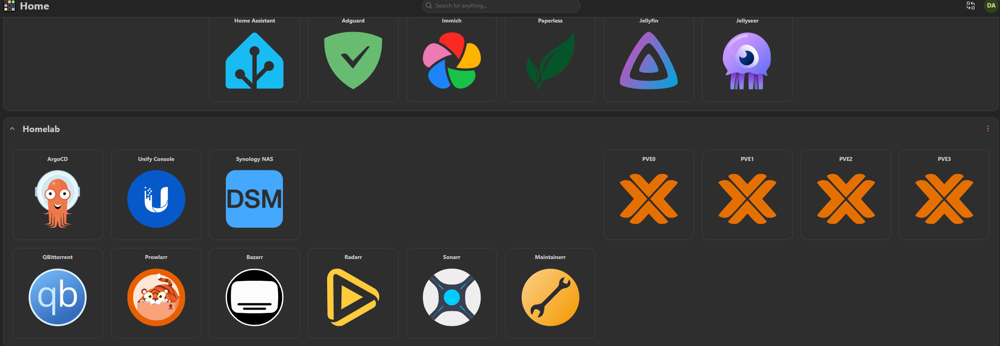

| Namespace     | PVC Name                        | Status | Volume                                   | Size | Access Mode | Storage Class |
| ------------- | ------------------------------- | ------ | ---------------------------------------- | ---- | ----------- | ------------- |
| x homarr        | homarr-database                 | Bound  | pvc-e41410af-f500-4b6d-ab32-fd72ba9b9cc2 | 1Gi  | RWO         | local-path    |
| x immich        | immich-postgres-data            | Bound  | pvc-a5b12e52-fe08-4b07-a776-b5f6b9e31ae7 | 20Gi | RWO         | local-path    |
| x paperless-ngx | data-paperless-ngx-postgresql-0 | Bound  | pvc-17f4b6e3-b7a9-498b-939b-ce642588fffb | 10Gi | RWO         | local-path    |
| x paperless-ngx | paperless-postgres-data         | Bound  | pvc-344edef4-7d33-4b0e-a4f5-57f719bc50a3 | 10Gi | RWO         | local-path    |
| x servarr       | bazarr-config                   | Bound  | pvc-4b9f73b1-c312-40aa-87ef-8ba964bf3382 | 2Gi  | RWO         | local-path    |
| x servarr       | jellyfin-config                 | Bound  | pvc-7d59cac2-262d-469f-a39f-5be6622703c9 | 5Gi | RWO         | local-path    |
| x servarr       | jellyseerr-config               | Bound  | pvc-646216c9-3e40-4f30-b026-fb85e82d3472 | 2Gi  | RWO         | local-path    |
| x servarr       | maintainerr-config              | Bound  | pvc-eb06bc7e-21e4-4168-baa7-6412f1044ee0 | 2Gi  | RWO         | local-path    |
| x servarr       | prowlarr-config                 | Bound  | pvc-40899fbb-cfbd-47f8-9fdf-a80bf8736469 | 2Gi  | RWO         | local-path    |
| x servarr       | qbittorrent-config              | Bound  | pvc-59fcc12a-9c57-4b36-bb00-6dd47e591d5f | 5Gi  | RWO         | local-path    |
| x servarr       | radarr-config                   | Bound  | pvc-69c9d2ee-e2c3-47e9-88fc-29ddf326556a | 5Gi  | RWO         | local-path    |
| servarr       | sonarr-config                   | Bound  | pvc-5b8a24cc-71d2-4584-9aaa-f9e5d01a0c4d | 5Gi  | RWO         | local-path    |
